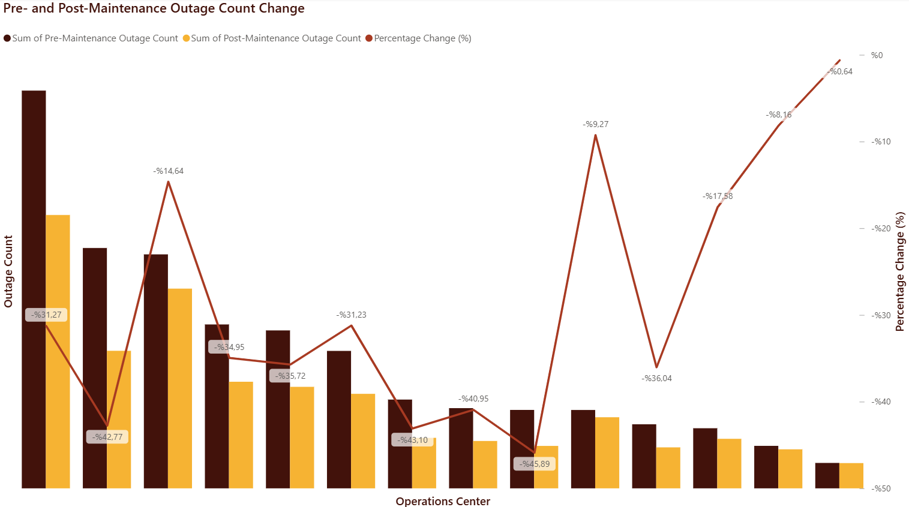
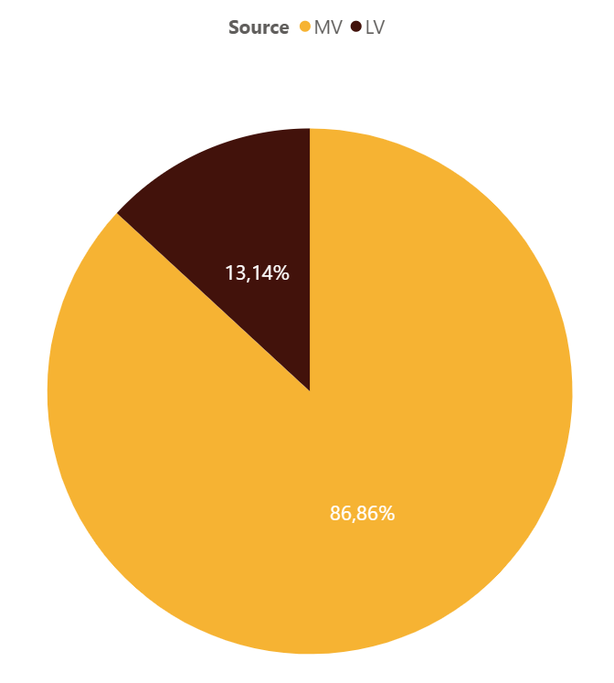
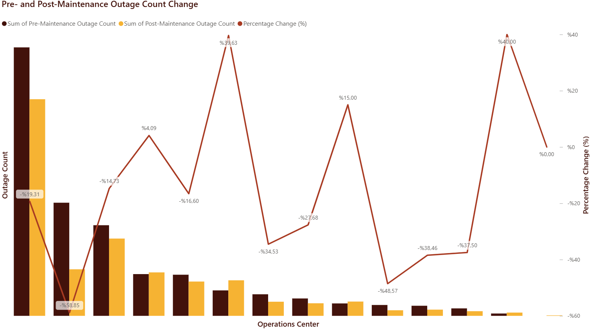
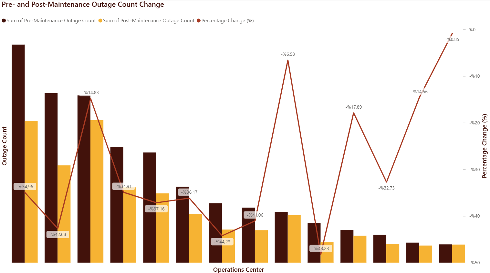
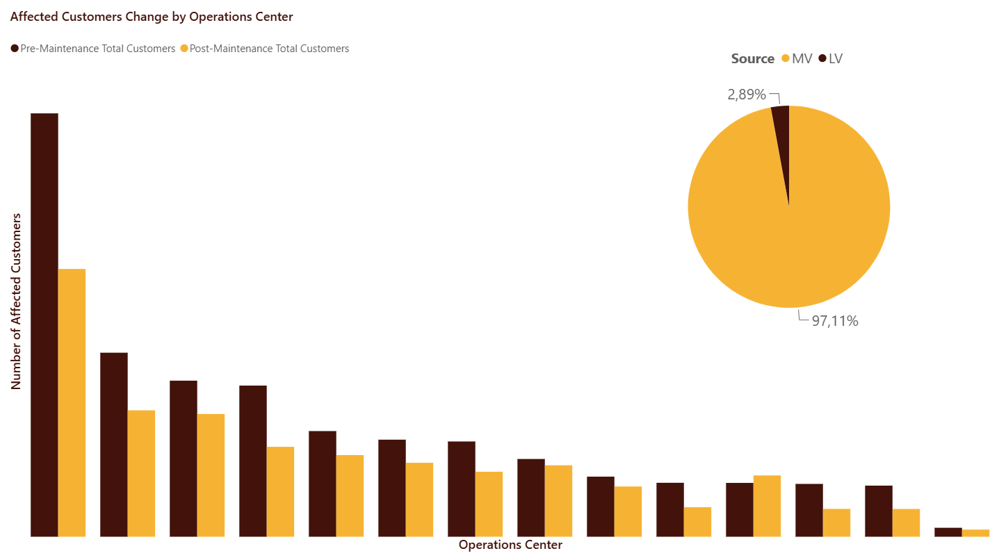
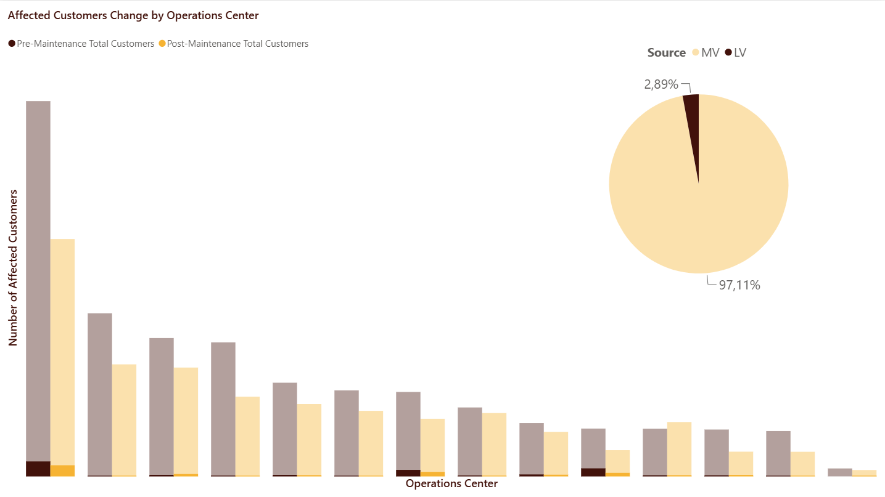
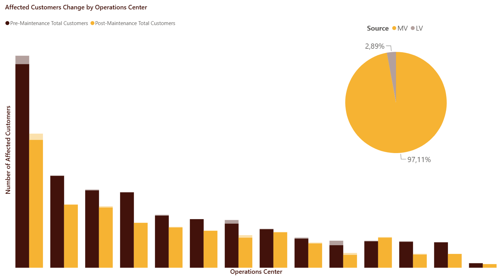
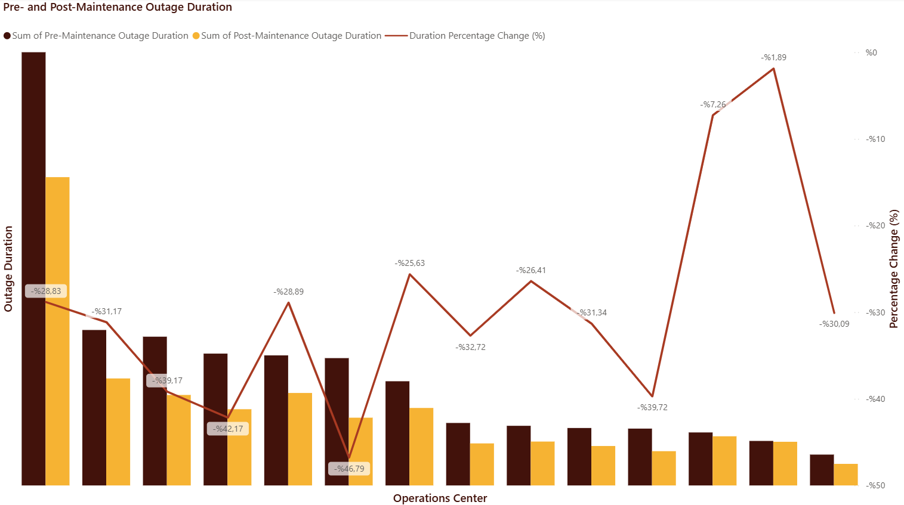

# ⚡ Grid Maintenance and Outage Impact Analysis 
*🇹🇷 Türkçe versiyon için [aşağıya kaydırın](#türkçe-versiyon)*

## 📌 Project Overview
Electrical grid reliability is critical for minimizing service disruptions and ensuring continuous energy delivery. This project was developed to evaluate the quantitative impact of scheduled grid maintenance operations on power outages across various regional operational centers. By transforming raw enterprise grid telemetry and maintenance logs into actionable business intelligence, the dashboard provides deep analytical visibility into how proactive interventions influence fault frequencies, customer disruptions, and total outage durations.

### 🏗️ Project Architecture & Workflow
The end-to-end data lifecycle of this project was meticulously designed following industry best practices:
1. **Data Preparation & Cleaning (Python & Excel):** Raw outage logs and field telemetry were initially ingested, cleaned, and structured using Python (`pandas`, `numpy`) and Excel to handle missing values, standardize timestamps, and normalize categorical fields across massive operational datasets.
2. **ETL & Transformation (Power Query):** The cleaned data was loaded into Power Query for advanced data transformation, conditional column creation, and mapping operational hierarchies.
3. **Data Modeling (Star Schema):** Built a robust **Star Schema** architecture, separating fact tables (outage events, durations, and affected customer counts) from dimension tables (operational centers, voltage levels, and maintenance status) to ensure optimal query performance and relational integrity.
4. **Advanced Analytics & DAX:** Developed complex DAX measures (calculating pre- and post-maintenance variance, percentage changes, and aggregated KPIs) to enable dynamic comparisons.
5. **Interactive Visualization (Power BI):** Designed executive-ready dashboards featuring clean card visuals, dual-axis trend lines, breakdown pie charts, and synchronized regional filters.

### 🎯 Key Business Questions Addressed
* **What is the measurable ROI of preventive maintenance?** Quantifying whether scheduled interventions effectively suppress recurring fault frequencies and shorten restoration times.
* **Where should field operations and capital allocation focus?** Identifying high-impact operational centers and voltage tiers that drive the vast majority of customer disruptions.
* **How do Medium Voltage (MV) vs. Low Voltage (LV) incidents differ in scale?** Comparing trunk-line stability against localized distribution bottlenecks.

> **🔒 Data Privacy Notice:** Due to strict company confidentiality, all original datasets and the Power BI Template (`.pbit`) file have been permanently excluded. This repository showcases the project design, visual structures, and analytical insights exclusively through documentation and screenshots.

### 📊 Dashboard Views & Analytical Insights

**1. Overall Outage Frequency Impact**

  

> 💡 *Key Insight:* Demonstrates a measurable decrease in fault frequency post-intervention, validating the effectiveness of scheduled preventive maintenance in suppressing recurring grid anomalies and enhancing overall network resilience.

  

**2. Outage Source Distribution**

  

> 💡 *Key Insight:* Highlights that Medium Voltage (MV) lines account for the vast majority of outage distribution (86.86%), indicating that capital allocation and predictive maintenance strategies must prioritize high-voltage feeder networks to maximize ROI on field operations.

  

**3. Low Voltage (LV) Outage Frequency Analysis**

  

> 💡 *Key Insight:* Provides granular, localized visibility into Low Voltage network performance, mapping regional response efficiencies and helping operations centers isolate low-tier distribution bottlenecks.

  

**4. Medium Voltage (MV) Outage Frequency Analysis**

  

> 💡 *Key Insight:* Evaluates trunk-line stability for Medium Voltage infrastructure, illustrating how targeted interventions on critical feeders successfully mitigate widespread outages and protect downstream assets.

  

**5. Overall Affected Customers Impact**

  

> 💡 *Key Insight:* Quantifies a significant post-maintenance reduction in affected customers across operations centers. Furthermore, the proportional breakdown reveals that Medium Voltage (MV) faults drive 97.11% of customer interruptions, whereas Low Voltage (LV) accounts for 2.89%, proving that high-voltage maintenance is the primary driver for protecting large consumer bases.

  

**6. Low Voltage (LV) Affected Customers Analysis**

  

> 💡 *Key Insight:* Evaluates localized customer impact within Low Voltage networks (representing 2.89% of overall customer exposure), demonstrating how targeted tier-2 maintenance effectively minimizes residential and small-scale commercial disruptions.

  

**7. Medium Voltage (MV) Affected Customers Analysis**

  

> 💡 *Key Insight:* Focuses on the heavy-impact Medium Voltage tier (accounting for 97.11% of affected customers), illustrating how feeder-line optimization successfully shields massive consumer groups from widespread blackouts.

  

**8. Overall Outage Duration Impact**

  

> 💡 *Key Insight:* Quantifies a consistent 25% to 45% contraction in total outage durations across regional operational centers, proving that maintenance optimization directly translates to minimized downtime and maximized service continuity.

### 🎯 Key Metrics & Visualizations
The dashboard focuses on translating raw grid data into actionable business intelligence through the following key visuals:
*   **Impact on Outage Frequencies:** Tracks the percentage change in the number of outage incidents resulting from maintenance work.
*   **LV & MV Breakdowns:** Detailed comparative performance metrics separated by grid voltage levels.
*   **Affected Customers Analysis:** Evaluates the scale of maintenance effectiveness based on the reduction of impacted customers, highlighting the critical 97.11% MV vs. 2.89% LV customer exposure distribution.
*   **Impact on Outage Durations:** Analyzes the change in total outage durations before and after maintenance interventions.

### 🛠️ Tools & Techniques
*   **Business Intelligence:** Power BI (DAX, Interactive Slicers, Custom Tooltips)
*   **Data Engineering & ETL:** Python (`pandas`, `numpy`), Excel, Power Query
*   **Data Modeling:** Star Schema Architecture (Fact & Dimension Tables)
*   **Languages:** Python, DAX (Data Analysis Expressions)

---

<h2 id="türkçe-versiyon">⚡ Şebeke Bakım ve Kesinti Etki Analizi</h2>

## 📌 Proje Özeti
Elektrik şebekesi güvenilirliği, enerji kesintilerinin en aza indirilmesi ve kesintisiz enerji arzının sağlanması açısından hayati önem taşır. Bu proje, planlı şebeke bakım operasyonlarının farklı bölgesel operasyon merkezlerindeki güç kesintileri üzerindeki kantitatif etkisini değerlendirmek amacıyla geliştirilmiştir. Yüz binlerce arıza kaydı ve bakım logunu içeren büyük ölçekli kurumsal şebeke verileri iş zekasına dönüştürülerek; proaktif müdahalelerin arıza sıklıklarını, müşteri mağduriyetlerini ve toplam kesinti sürelerini nasıl optimize ettiğine dair derinlemesine analitik içgörüler sunulmuştur.

### 🏗️ Proje Mimarisi ve İş Akışı
Bu projenin uçtan uca veri yaşam döngüsü, endüstri standartlarına uygun olarak titizlikle tasarlanmıştır:
1. **Veri Hazırlama ve Temizleme (Python & Excel):** Ham arıza logları ve saha telemetrisi; eksik verilerin işlenmesi, zaman damgalarının standardize edilmesi ve kategorik alanların normalleştirilmesi için Python (`pandas`, `numpy`) ve Excel kullanılarak işlenmiştir.
2. **ETL ve Dönüştürme (Power Query):** Temizlenen veriler, gelişmiş veri dönüşümleri, koşullu sütun oluşturma ve operasyonel hiyerarşilerin haritalandırılması için Power Query'ye aktarılmıştır.
3. **Veri Modelleme (Yıldız Şema - Star Schema):** Sorgu performansını ve ilişkisel bütünlüğü maksimize etmek amacıyla; olgu tablolarını (arıza olayları, süreler ve etkilenen abone sayıları) boyut tablolarından (operasyon merkezleri, gerilim seviyeleri ve bakım durumu) ayıran sağlam bir Yıldız Şema mimarisi kurulmuştur.
4. **İleri Düzey Analitik ve DAX:** Dinamik karşılaştırmalara olanak tanımak için gelişmiş DAX formülleri (bakım öncesi/sonrası varyans, yüzde değişim ve birleştirilmiş KPI hesaplamaları) geliştirilmiştir.
5. **İnteraktif Görselleştirme (Power BI):** Temiz kart görünümleri, çift eksenli trend çizgileri, dağılım pastaları ve senkronize bölgesel filtrelerle yönetici seviyesinde raporlar tasarlanmıştır.

### 🎯 Çözülen Temel İş Soruları
* **Koruyucu bakımların ölçülebilir yatırım getirisi (ROI) nedir?** Planlı müdahalelerin tekrarlayan arıza sıklıklarını ne ölçüde bastırdığı ve onarım sürelerini kısalttığı analiz edilmiştir.
* **Saha operasyonları ve sermaye tahsisi nereye odaklanmalıdır?** Müşteri mağduriyetlerinin büyük kısmını tetikleyen kritik operasyon merkezleri ve gerilim kademeleri izole edilmiştir.
* **Orta Gerilim (OG) ve Alçak Gerilim (AG) olayları ölçek olarak nasıl ayrışır?** Ana hat omurga kararlılığı ile yerel dağıtım darboğazları kıyaslanmıştır.

> **🔒 Veri Gizliliği Notu:** Şirket gizlilik politikaları gereği, tüm orijinal veri setleri ve Power BI Şablon (`.pbit`) dosyası kapsam dışı bırakılmıştır. Bu depo, dokümantasyon ve ekran görüntüleri aracılığıyla proje tasarımını, görsel yapıları ve analitik içgörüleri sergilemektedir.

### 📊 Dashboard Görünümleri ve Bulgular

**1. Genel Kesinti Sayısı Etkisi**

  

> 💡 *Analitik Bulgu:* Müdahaleler sonrasında arıza sıklığında ölçülebilir bir düşüş olduğunu göstererek, planlı koruyucu bakımların tekrarlayan şebeke anomalilerini bastırmadaki ve şebeke direncini (resilience) artırmadaki etkinliğini doğrular.

  

**2. Kaynak Dağılımı**

  

> 💡 *Analitik Bulgu:* Kesintilerin çok büyük bir kısmının (%86,86) Orta Gerilim (OG) hatlarından kaynaklandığını ortaya koyarak; saha operasyonlarında yatırım getirisini (ROI) maksimize etmek için sermaye tahsisi ve kestirimci bakım stratejilerinin ana besleme hatlarına odaklanması gerektiğini vurgular.

  

**3. Alçak Gerilim (AG) Kesinti Analizi**

  

> 💡 *Analitik Bulgu:* Alçak gerilim şebeke performansına bölgesel ve ayrıntılı bir vizyon kazandırarak, operasyon merkezlerinin uç nokta dağıtım darboğazlarını izole etmesine ve yerel müdahale etkinliğini haritalandırmasına olanak tanır.

  

**4. Orta Gerilim (OG) Kesinti Analizi**

  

> 💡 *Analitik Bulgu:* Kritik orta gerilim altyapısı için ana hat kararlılığını değerlendirerek, kritik besleyiciler üzerinde yapılan hedefli müdahalelerin yaygın kesintileri nasıl başarıyla önlediğini ve alt şebeke varlıklarını koruduğunu gösterir.

  

**5. Genel Etkilenen Müşteri Sayısı Etkisi**

  

> 💡 *Analitik Bulgu:* Bakım sonrasında operasyon merkezlerindeki etkilenen müşteri sayılarında belirgin bir düşüş olduğunu kantitatif olarak kanıtlar. Ayrıca, kesintilerden etkilenen müşterilerin %97,11'inin Orta Gerilim (OG), %2,89'unun ise Alçak Gerilim (AG) kaynaklı olduğunu göstererek yüksek gerilim bakımlarının kitleler üzerindeki koruyucu etkisini gözler önüne serer.

  

**6. Alçak Gerilim (AG) Etkilenen Müşteri Analizi**

  

> 💡 *Analitik Bulgu:* Toplam müşteri maruziyetinin %2,89'unu oluşturan Alçak Gerilim şebekesindeki yerel müşteri etkilerini değerlendirerek, uç nokta bakımlarının konut ve küçük ölçekli ticari kesintileri nasıl azalttığını inceler.

  

**7. Orta Gerilim (OG) Etkilenen Müşteri Analizi**

  

> 💡 *Analitik Bulgu:* Etkilenen müşteri kitlesinin %97,11 gibi ezici bir oranını barındıran kritik Orta Gerilim besleme hatlarına odaklanarak, yüksek gerilim optimizasyonunun geniş tüketici gruplarını yaygın kesintilerden korumadaki hayati rolünü vurgular.

  

**8. Genel Kesinti Süresi Etkisi**

  

> 💡 *Analitik Bulgu:* Bölgesel operasyon merkezlerinde toplam kesinti sürelerinde tutarlı bir şekilde %25 ila %45 daralma olduğunu kantitatif olarak kanıtlayarak, bakım optimizasyonunun doğrudan minimum kesinti süresine (downtime) ve gelişmiş hizmet sürekliliğine dönüştüğünü gösterir.

### 🛠️ Kullanılan Araçlar ve Teknikler
*   **İş Zekası (BI):** Power BI (DAX, İnteraktif Dilimleyiciler, Özel Araç İpuçları)
*   **Veri Mühendisliği ve ETL:** Python (`pandas`, `numpy`), Excel, Power Query
*   **Veri Modelleme:** Yıldız Şema Mimarisi (Olgu ve Boyut Tabloları)
*   **Diller:** Python, DAX (Data Analysis Expressions)
